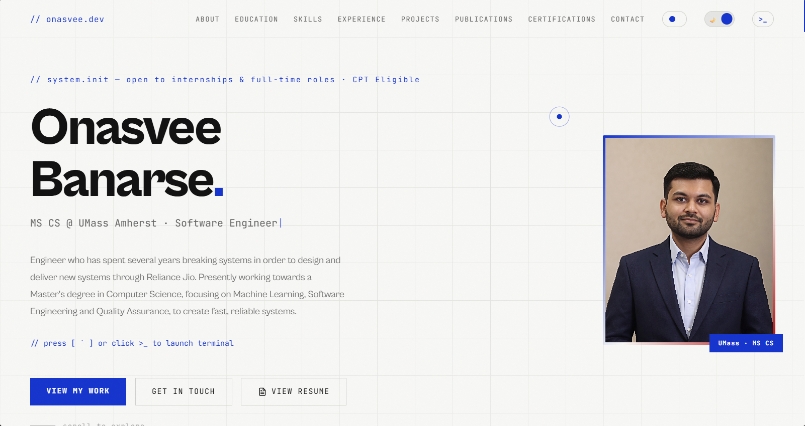

# Onasvee Banarse | Personal Portfolio & Interactive Sandbox



A highly interactive, terminal-inspired developer portfolio showcasing my background in software engineering, machine learning research, and QA automation. 

Rather than relying on heavy frontend frameworks, this site is engineered entirely from scratch using **Vanilla JavaScript, HTML5 Canvas, and advanced CSS3**. It serves as a live technical demonstration of deep DOM manipulation, state management, and custom physics rendering.

🌐 **Live Site:** [orion-22.github.io](https://orion-22.github.io/)

---

## 🚀 Technical Highlights & Features

* **Interactive Terminal Engine:** A custom-built command-line interface featuring input parsing, history tracking, autocomplete, and hidden executables.
* **Dynamic Theming Architecture:** Utilizes CSS variables and `data-theme` attributes to instantly shift the entire site's aesthetic without page reloads.
* **F1 Telemetry Mode:** Transforms the UI into a pit-wall data dashboard complete with carbon-fiber weave gradients, live mouse-tracking coordinates, and a dynamic sector scrollbar.
* **Spacecraft Trajectory Simulation:** A procedurally generated SVG orbital map using mathematical arc spirals (`requestAnimationFrame`) to simulate a Cassini-style gravity assist trajectory in the background.
* **Canvas Physics Simulator:** A built-in 2D racing engine that renders real-time kinematics and leaderboard sorting on an HTML5 `<canvas>`.
* **Autonomous DOM Entities:** SVG elements (like the Perseverance Rover) that escape the terminal and utilize linear interpolation (Lerp) to track and follow the user's cursor across the viewport.
* **In-House Document Viewer:** Custom modal architecture to render resumes and research papers internally without forcing users to download PDFs or bounce to external tabs.

---

## 💻 Tech Stack

* **Structure:** HTML5, Semantic UI, SVG Architecture
* **Styling:** CSS3 (Custom Properties/Variables, Backdrop Filters, Advanced Gradients, CSS Grid/Flexbox)
* **Logic & Animation:** Vanilla JavaScript (ES6+), HTML5 Canvas API, `requestAnimationFrame` Game Loops, DOM Event Listeners

---

## ⌨️ Interactive Commands

To explore the site's deeper features, open the terminal `[ >_ ]` on the live site and try the following commands:

**System Commands:**
* `help` - Lists all standard executable commands.
* `about` - Prints a summary of my background and current status.
* `projects` - Outputs recent software and ML projects.
* `clear` - Wipes the terminal output.

**Theme Overrides:**
* `theme f1` - Initializes Pit-Wall Telemetry aesthetic.
* `theme space` - Initializes Aerospace / NASA telemetry aesthetic.
* `theme dark` - Reverts to the standard dark mode UI.

**Simulations & Easter Eggs:**
* `race` - Injects a live 3-lap 2D telemetry racing simulation.
* `rover` - Deploys a rover to the footer that physically tracks your cursor.
* `jwst` / `telescope` / `launch` - Triggers various aerospace observation popups.

---

## ⚙️ Local Setup

Since this project has zero external dependencies or build steps, running it locally is instantaneous.

1. Clone the repository:
   ```bash
   git clone [https://github.com/ORION-22/orion-22.github.io.git](https://github.com/ORION-22/orion-22.github.io.git)